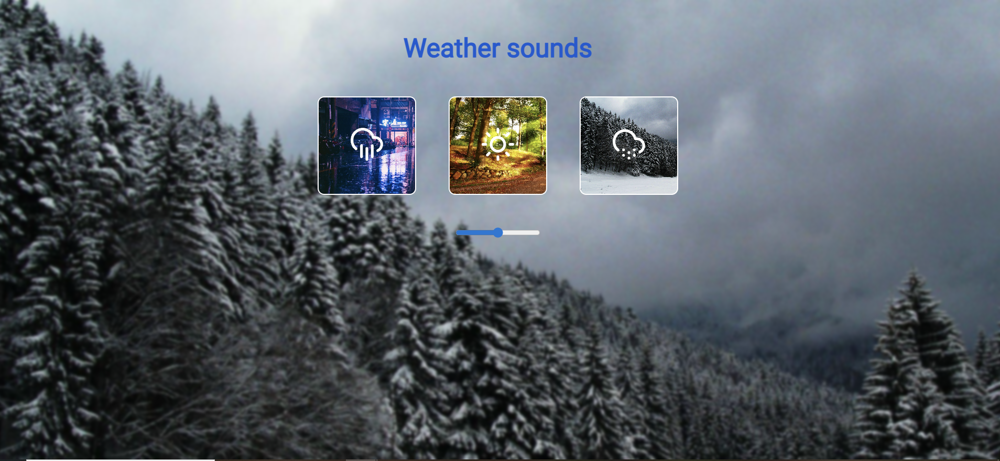

# Nature Sounds Player (учебный проект, направленный на закрепление навыков webpack сборки)

## Описание проекта
Веб-приложение для воспроизведения звуков природы с возможностью переключения между разными атмосферами. Учебный проект с настройкой Webpack с нуля.

## Функционал
- Воспроизведение 3 видов звуков природы (дождь, лето, зима)
- Переключение фоновых изображений при смене звука
- Регулятор громкости
- Автоматическая остановка предыдущего звука при включении нового
- Возможность паузы/продолжения воспроизведения

## Технологии
### Frontend
- TypeScript
- Webpack (ручная настройка)
- HTML5 Audio API


### Инструменты сборки
- Webpack Plugins:
  - HtmlWebpackPlugin
  - CopyPlugin
  - MiniCssExtractPlugin
  - ESLintPlugin

## Установка и запуск
```bash
# Установка зависимостей
npm install

# Запуск dev-сервера
npm run dev

# Сборка production-версии
npm run build

## Скриншот интерфейса

